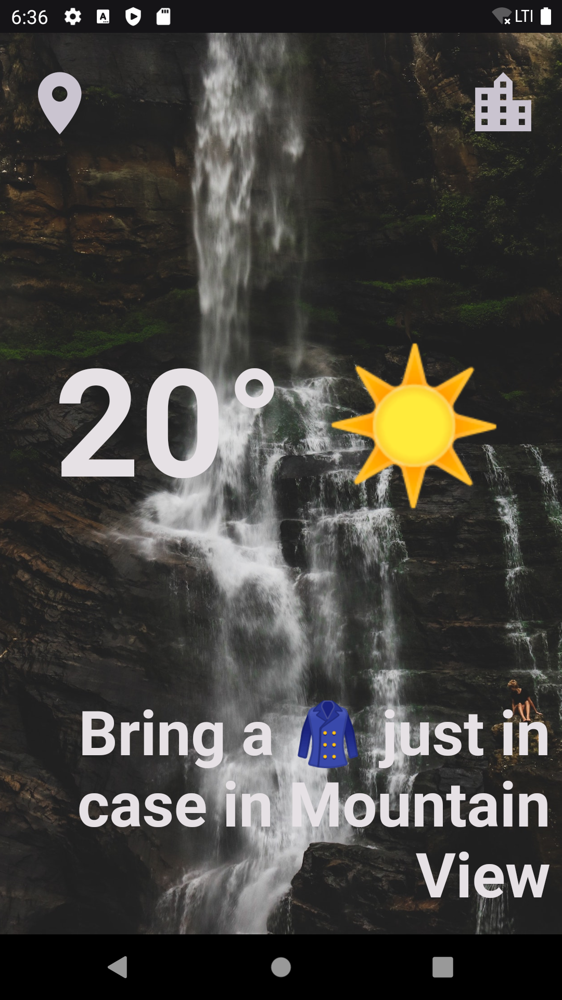
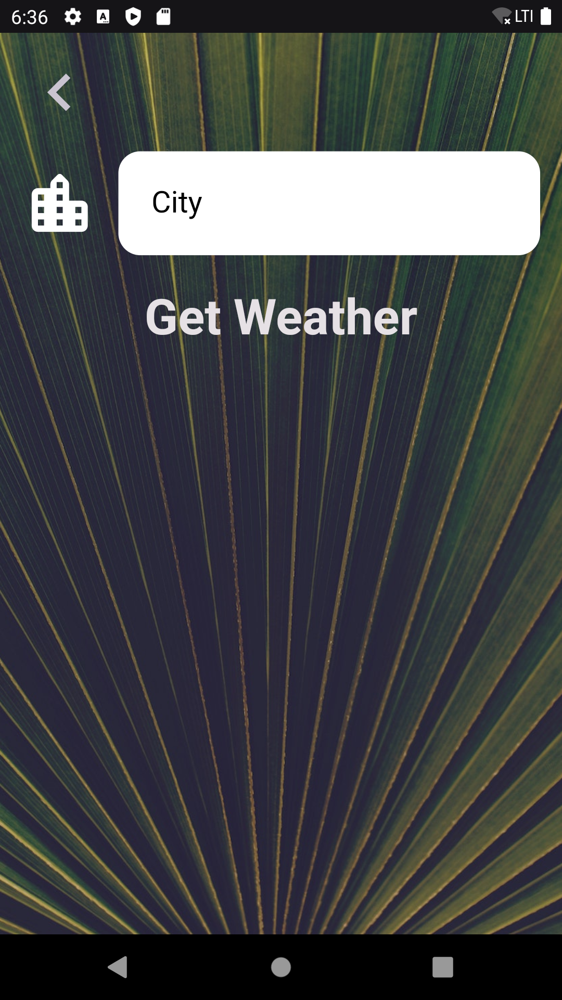
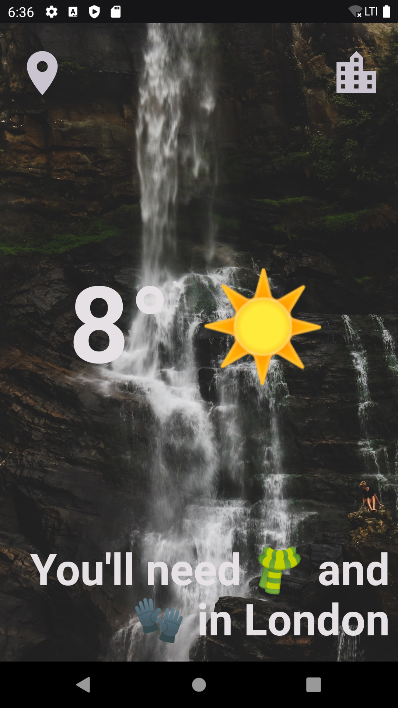
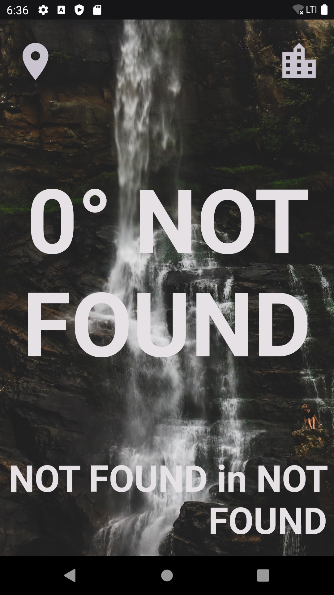

# **air**

## This is a mid level Flutter project.

 

## **About This App**

---

## To use this app you need to register _https://openweathermap.org_ this web site.

## They will give you a api key and only you need to do is go to the this file: lib/apiKey/api_key.dart then put your api key between quotes.

## All is done 👍

### This is a Weather Application.

### It is build on two part.

### - Coordination Part

### - City Part

---

 

## **Applicaton Workflow**

---

When application start app ask for permission to reach your location.

If you give your permission to app.

Application reach your coordinate and reach weather your area.

 

## **_Sample Image_**

---

---

 

As you can see there are two button up there.

The right one go to the search screen

 

## **_Sample Image_**

---

---

As you see there is a search field.

You can click Get Weather button then it will give you city weather you typed.

 

## **_Sample Image_**

---

---

 

## If you type rubbish or keep it blank then it will give you this screen

 

## **_Sample Image_**

---

---

 

If you click the button on the left.

It will reach your coordinate and it will give you the weather where you are.

 

## **_Sample Image_**

---

---

 
